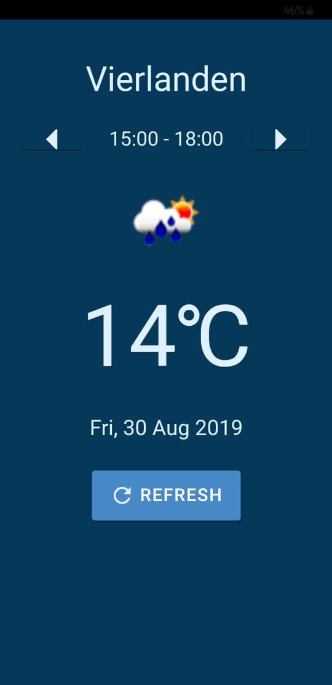

# ionic-4-weather-app

This app is an Ionic 4 PWA that uses https://openweathermap.org/ 's API

The app displays 5 day / 3 hour forecast data based on your current location

motivation for build: fun 1 day app build

TODO

in /src/app/weather-api.service.ts

```ts
import { Injectable } from "@angular/core";
import { HTTP } from "@ionic-native/http/ngx";
import { HttpClient, HttpHeaders } from "@angular/common/http";
import { Observable } from 'rxjs';

@Injectable({
  providedIn: "root"
})
export class WeatherApiService {
  apiKey = "Your Open Weather Map API Key Here";

  constructor(private http: HTTP, private ngHttp: HttpClient) {}

  getWeather(lat, lng): Observable<any> {
    return this.ngHttp.get<any>(
      `http://api.openweathermap.org/data/2.5/forecast?lat=${lat}&lon=${lng}&units=metric&APPID=${this.apiKey}`
    );
  }
}
```

Preview


